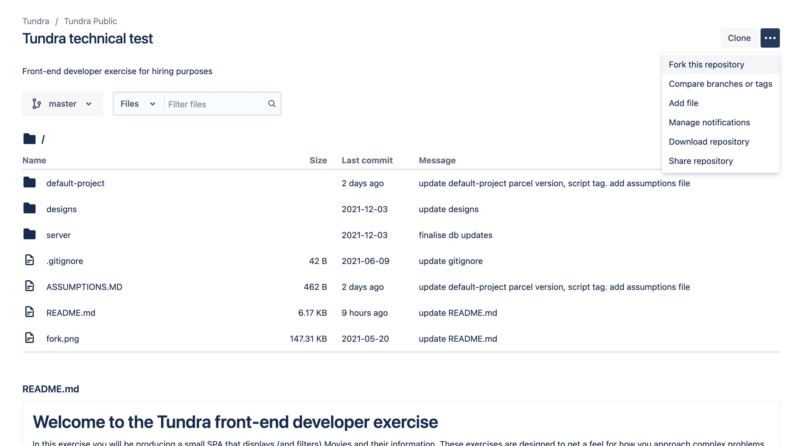

# Welcome to the Tundra front-end developer exercise

In this exercise you will be producing a small SPA that displays (and filters) 
Movies and their information. These exercises are designed to get a feel for how you approach complex problems.

## Introduction

You will be building a single page application using whatever technology you prefer, be it a vanilla js or a javascript framework. We are 
big fans of VueJS, however we are excited to see whichever direction you decide to go in.

The data required for this task will be available on a local api server in JSON format. You will be expected to fetch 
(or AJAX) the data into your web application and manipulate/filter the results to display.

The design and strategy teams have provided you with some supporting designs and functional specifications
which can be found in `designs/Tundra_Technical_Test.fig`.

Above all, we're not expecting a fully completed test. We're looking for your attention to detail, approach, and to see how you tackle different problems.

Good luck!

## Prerequisites

- You have [Node](https://nodejs.org/en/) v14 with npm or yarn installed
- You are familiar with entering simple [terminal commands](http://blog.teamtreehouse.com/introduction-to-the-mac-os-x-command-line)
- You are familiar with [Git source control](https://product.hubspot.com/blog/git-and-github-tutorial-for-beginners)
- You will require an internet connection to install npm packages
- An editor of your choice (e.g. [VSCode](https://code.visualstudio.com/), [Sublime Text](https://www.sublimetext.com/), [WebStorm](https://www.jetbrains.com/webstorm/), [Atom](https://atom.io/), or your own editor/IDE)
- [Figma Desktop App](https://www.figma.com/downloads/) or a [Figma account](https://www.figma.com/) to view the design files in browser

## Getting started
To get set up, you will need to

1. [Create a free Bitbucket account](https://id.atlassian.com/signup)
2. Fork this repository under your new account

    

3. Name the repository `tundra-fed-test-<your-name>` and leave it public

## Instructions

**1. Assumptions**

Please list any assumptions, in the `ASSUMPTIONS.md`, file that you have made in order to solve any problems.

**2. Read the Getting Started guide below and choose one solution technology (eg VueJS)**

**3. Read the Requirements and start building your application**

**4. Submit your solution for review.** (Submission details are down below.)

## Getting started

We have provided you with a desktop design file for the app, located in `designs/Tundra_Technical_Test.fig`. You should 
make your solution match these designs as closely as possible. Unfortunately, the design team have not provided any 
mobile designs and look to your expertise in making it responsive. The font used is called `Roboto Condensed` and is readily available on the internet. 

The strategy team have also provided you with some functional specifications as comments throught the design file within figma, please check these comment carefully to ensure no technical detail is missed.

We have provided you with a starting project in Vanilla JS using SCSS and [parcel.js](https://v2.parceljs.org/) as a bundler. Note that while these files have been boilerplated for you, feel free to modify the folder structure as you see fit, or even create an entirely new project folder (i.e. create-react-app, vue-cli, etc.) but remember, we will evaluate the structure you use and keep in mind you still need to adhere to all requirements listed below.

## Requirements

Please allocate yourself 4 hours to complete the following. You are expected to prioritise your 
tasks to deliver the most overall complete application in this time frame. 

We are aware that you will not be able to complete the entire exercise within the 4 hour timeframe, 
we have designed the excerise this way in-order to gauge how you approach real-world projects, and to highlight your ability
to articulate remaining tasks (i.e. handover documentation for another developer to pick up where you left off).

If you do choose to spend more that the 4 hours please let us know how long you spent in the `ASSUMPTIONS.md` file when you submit your response

- In your approach, consider this project exactly as you would a real-world project.
- Your solution must be a responsive web application.
- Please use SCSS if you would like to use a precompiler for CSS.
- Your application must fetch/ajax all movie data. By default, ALL movies should be listed.
- If at anytime, there is no listing data to display, your application should tell users there are no results.
- If your application is ever busy, this should be reflected in the interface (eg a loader).
- Your solution must work in latest Chrome/Firefox/Safari (including touch devices).
- Your solution must be valid, semantic HTML and Accessible to the WCAG 2.0 Level AA standard
- You must follow the functional specification (listed as comments in figma) guidelines.
- Consistent code formatting is good. We recommend using a linter for your CSS and JS.

### Solution Technologies

**Option 1 - Vanilla JS**

1. Change into the `default-project` folder and run `yarn install`. 
1. Start the project via `yarn serve`.
1. You can then view the project by visiting `localhost:8080` in your browser.
1. Open the `default-project` in your editor to make changes
 
### API Server

Your solution will require interaction with a local API server that provides data.

To start the server, use a separate terminal window with the following:

1. Change into the `server` directory and run `yarn install`
1. Start the server via `yarn serve`

The following 2 endpoints will now be available.

| Endpoint                             | Description                       |
| ------------------------------------ | --------------------------------- |
| http://localhost:3000/movies         | returns an array of movie data    |
| http://localhost:3000/genres         | returns genres                    |

### Stopping the projects and server

If at anytime you want to stop the project servers. Press keys `control + c` in the terminal.

## Submitting your solution

Email the link to your repository to fbf-software@tundra.com.au, and include "Tundra FED Test - your name" as the subject line.
